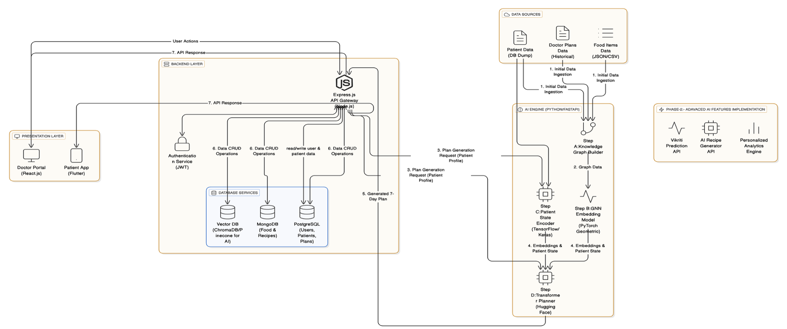

# AyurAhaar

**Ayurahaar** is a digital healthcare platform that fuses Ayurveda-based nutrition with AI-powered personalization, making holistic diet guidance accessible for all.

## Architecture



The above diagram illustrates the overall architecture of AyurAhaar:

- **Mobile App:** Used by both patients and doctors for surveys, meal plans, consultations, and progress tracking.
- **Web Dashboard:** A powerful interface for doctors to manage patients, review analytics, and monitor diet adherence.
- **Backend Services:** Power AI-driven meal plan generation, user authentication, and data storage.
- **Database:** Stores user profiles, survey responses, meal plans, and consultation records securely.

This modular architecture ensures seamless integration between patients, doctors, and AI services, providing a connected and scalable healthcare experience.

## Features

### For Patients
- Quick onboarding survey (age, weight, lifestyle, allergies, conditions)
- Personalized Ayurveda diet plans (AI-driven)
- Doctor consultations (chat/video)
- Daily dashboard for meals & progress
- Notifications & reminders

### For Doctors
- Secure login
- Access to patient surveys & health history
- Approve, reject, or edit meal plans
- Communicate with patients (chat/video)
- Web dashboard for analytics & management

## Vision

Empowering everyone with personalized Ayurveda nutrition—bridging patients and doctors through a single, connected platform.

## Project Structure

- `mobile_app/` — React Native app for patients and doctors
- `docs/` — Documentation and datasets
- `web-app/` - React Dashboard for doctors

## Getting Started

1. Clone the repository:
	```sh
	git clone https://github.com/Abhinay2206/AyurAhaar
	```
2. Go to the mobile app directory:
	```sh
	cd mobile_app
	```
3. Install dependencies:
	```sh
	npm install
	# or
	yarn install
	```

4. Run the app:
	```sh
	npm start
	# or
	yarn start
	```

### Web App (Doctors)

1. Go to the web app directory:
	```sh
	cd web-app
	```
2. Install dependencies:
	```sh
	npm install
	# or
	yarn install
	```
3. Start the development server:
	```sh
	npm run dev
	# or
	yarn dev
	```
4. Open your browser and go to the local address shown in the terminal (usually http://localhost:5173).

## License


